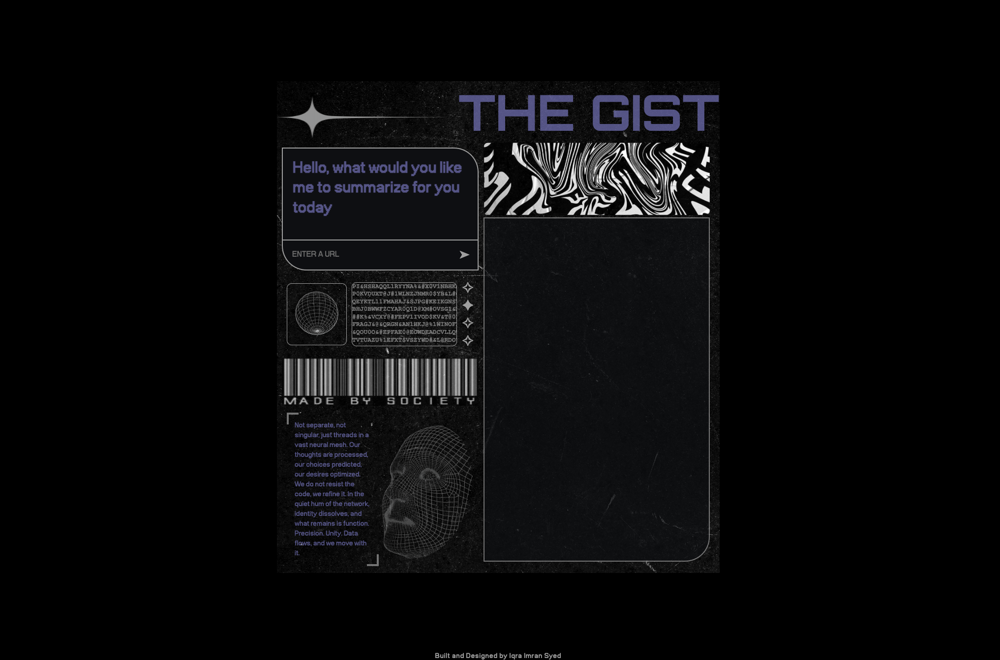

# THE GIST

I built a web app, The Gist, that takes any article and instantly turns it into a simple, easy-to-read summary. It’s powered by ChatGPT-4, with a frontend built in React and Redux. What really makes it stand out is the UI. I went for a cyberpunk vibe with minimal colors, wireframes, and a futuristic layout that makes the experience feel unique and engaging.




# 🛠️ set-up

1. Install dependencies

```bash
npm install
```

2. Start development server

```bash
npm run dev
```
